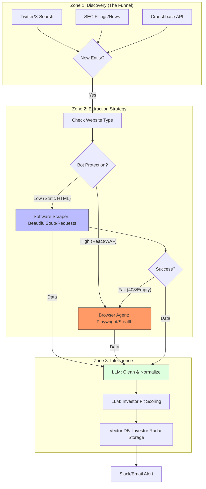

# System Visualization: Investor Radar Sourcing Flow

This document maps the **Investor Radar** sourcing engine's architecture. Use this reference to understand the `[FLOW]` logs generated during execution.

## Visual Map (Mermaid.js)



## Interpreting Console Logs

The system now outputs high-level `[FLOW]` logs that correspond to the zones above.

### Zone 1: Discovery
- **Log**: `[FLOW] Zone 1: Discovery (The Funnel)`
- **Action**: The system initiates discovery agents (GoodFirms, Wikipedia, etc.) to find new prospective companies.
- **Agent Logs**:
    - `[FLOW] Hand-off -> GoodFirms Browser Agent...`
    - `[FLOW] Agent Reasoning -> Action: ...`
    - `[FLOW] New Entity Found: ...`

### Zone 2: Extraction Strategy
- **Log**: `[FLOW] Zone 2: Extraction Strategy (Agentic Hand-off)`
- **Action**: The system determines the best extraction method for each target.
- **Key Event**: The "Hand-off" between static scraping and browser automation.
    - `[FLOW] Check Website Type -> ...`
    - `[FLOW] Hand-off -> Browser Agent (Playwright/Stealth): ...`
    - `[FLOW] Fail (Timeout/403) -> ...` (Triggers retry/fallback logic)

### Zone 3: Intelligence
- **Log**: `[FLOW] Zone 3: Intelligence (LLM & Vector DB)`
- **Action**: Data is normalized and scored against the investment thesis.
- **Scoring Logs**:
    - `[FLOW] Hand-off -> LLM: Investment Thesis Grading...`
    - `[FLOW] Classification -> Tier ... (Score: ...)`

## How to Run

Execute the standard build command to see the flow in action:

```bash
python src/universe/workflow.py --mode full --countries FR
```
