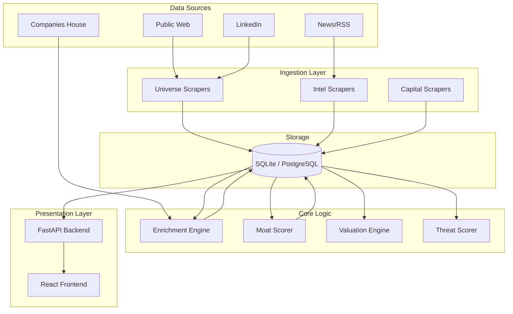

# System Architecture

## Overview

RADAR is a modular intelligence platform built on a modern Python stack. It is designed as a pipeline that ingests raw data from the web, enriches it with financial and semantic data, and processes it through various scoring engines to identify high-conviction investment targets.

## High-Level Architecture

## Data Flow

1.  **Discovery**: 
    - The `Universe Scanner` (`src.universe`) identifies potential targets via scrapers or API connectors.
    - Raw company records are created in the database with a "Draft" status.

2.  **Enrichment**:
    - The `Enrichment Engine` fetches financial data (revenue, EBITDA) from Companies House.
    - It scrapes company websites to extract "Signals" (e.g., "ISO 9001", "B2B", "SaaS").

3.  **Analysis & Scoring**:
    - **Moat Scoring**: The `MoatScorer` analyzes the enriched data against the 5-Pillar framework to assign a score (0-100).
    - **Threat Analysis**: The `Competitive Radar` checks for VC funding in similar sectors to flag potential threats.
    - **Valuation**: The `Deal Intelligence` module estimates valuation ranges based on market multiples.

4.  **Presentation**:
    - The `FastAPI` backend serves this data to the `React` frontend.
    - Users can view, filter, and manage targets in the dashboard.

## Technology Stack

### Backend
-   **Language**: Python 3.11+
-   **Framework**: FastAPI
-   **Database**: SQLite (Development) / PostgreSQL (Production ready)
-   **ORM**: SQLAlchemy + Alembic (Migrations)
-   **Browser Automation**: Playwright (for advanced scraping)
-   **Parsing**: BeautifulSoup4, lxml
-   **Validation**: Pydantic

### Frontend
-   **Framework**: React (Vite)
-   **Styling**: Tailwind CSS
-   **State Management**: React Query / Context
-   **Visualization**: Recharts, Framer Motion

## Directory Structure Strategy

The codebase is organized by **functional domain** (`src/domain_name`) rather than technical layer (models/views/controllers). This ensures that all logic related to a specific feature (e.g., "Capital") is self-contained.

-   `src/core`: Shared utilities, config, and database setup.
-   `src/universe`: The core "funnel" (Companies, Discovery, Scoring).
-   `src/intelligence`: Analytics and Valuation.
-   `src/capital`: PE/Investor tracking.
-   `src/web`: The API and UI application.
