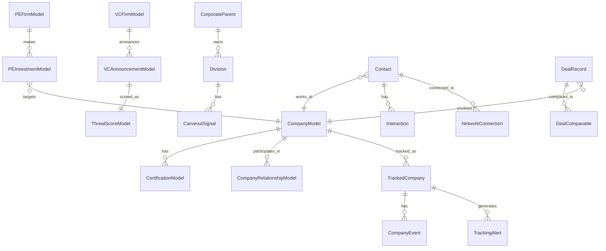

# Data Models Reference

This document provides a unified view of all database tables across RADAR's modules and how they relate to each other.

## Architecture Overview

RADAR uses **multiple databases** organized by domain:
- **Main Database** (`radar.db`): Core, Capital, Competitive, Carveout, Intelligence, Tracker, Relationships, Intel
- **Universe Database** (`universe.db`): Company discovery and moat scoring

All databases use **SQLAlchemy 2.0 AsyncIO** with support for SQLite (dev) and PostgreSQL (prod).

## Entity Relationship Overview



## Core Entities

### universe_companies (`CompanyModel`)
**Location**: `src.universe.database`  
**Purpose**: Central registry of all discovered companies.

| Field | Type | Description |
|-------|------|-------------|
| `id` | Integer | Primary key |
| `name` | String | Company name |
| `website` | String | URL |
| `hq_country` | String(2) | ISO country code |
| `revenue_gbp` | BigInteger | Annual revenue (£) |
| `employees` | Integer | Employee count |
| `sector` | String | Industry sector |
| `moat_score` | Integer | 0-395 defensibility score |
| `tier` | String | Tier classification (1A/1B/2) |
| `moat_attributes` | JSON | Pillar breakdown |

**Relationships**:
- `certifications`: One-to-Many with `CertificationModel`
- `relationships_as_a`, `relationships_as_b`: Many-to-Many via `CompanyRelationshipModel`

### certifications (`CertificationModel`)
**Location**: `src.universe.database`

| Field | Type | Description |
|-------|------|-------------|
| `company_id` | Integer | FK to `universe_companies` |
| `certification_type` | String | e.g., "AS9100", "ISO13485" |
| `scope` | String | Certification scope description |

## Capital Module

### pe_firms (`PEFirmModel`)
**Location**: `src.capital.database`

| Field | Type | Description |
|-------|------|-------------|
| `name` | String | PE firm name |
| `aum_usd` | BigInteger | Assets under management |
| `investment_strategy` | String | "buyout", "growth", etc. |
| `sector_focus` | JSON | Array of target sectors |

### pe_investments (`PEInvestmentModel`)
**Location**: `src.capital.database`

| Field | Type | Description |
|-------|------|-------------|
| `pe_firm_id` | Integer | FK to `pe_firms` |
| `company_id` | Integer | FK to `universe_companies` (if matched) |
| `company_name` | String | Portfolio company name |
| `entry_date` | Date | Investment date |
| `entry_valuation_usd` | BigInteger | Entry valuation |
| `moic` | Decimal | Multiple on Invested Capital |
| `pe_identified_moats` | JSON | Moats cited by PE firm |

## Competitive Module

### vc_firms (`VCFirmModel`)
**Location**: `src.competitive.database`

| Field | Type | Description |
|-------|------|-------------|
| `name` | String | VC firm name |
| `tier` | String | "A", "B", or "C" |
| `focus_sectors` | JSON | Investment focus areas |

### vc_announcements (`VCAnnouncementModel`)

| Field | Type | Description |
|-------|------|-------------|
| `vc_firm_id` | Integer | FK to `vc_firms` |
| `company_name` | String | Portfolio company |
| `round_type` | String | "Seed", "Series A", etc. |
| `amount_gbp` | BigInteger | Round size |

### threat_scores (`ThreatScoreModel`)

| Field | Type | Description |
|-------|------|-------------|
| `announcement_id` | Integer | FK to `vc_announcements` |
| `threat_level` | String | "HIGH", "MEDIUM", "LOW" |
| `threat_score` | Integer | 0-100 scoring |
| `reasoning` | Text | Justification |

## Tracker & Relationships

### tracked_companies (`TrackedCompany`)
**Location**: `src.tracker.database`

| Field | Type | Description |
|-------|------|-------------|
| `company_id` | Integer | FK to `universe_companies` |
| `priority` | String | "high", "medium", "low" |
| `tracking_status` | String | "ACTIVE", "CLOSED" |
| `next_check_due` | DateTime | When to re-scan |

### contacts (`Contact`)
**Location**: `src.relationships.database`

| Field | Type | Description |
|-------|------|-------------|
| `name` | String | Contact name |
| `company` | String | Associated company |
| `email` | String | Email address |
| `relationship_score` | Integer | 0-100 strength |
| `last_contact_date` | Date | Last interaction |

## Intelligence Module

### deal_records (`DealRecord`)
**Location**: `src.intelligence.database`

| Field | Type | Description |
|-------|------|-------------|
| `target_company_name` | String | Deal target |
| `deal_date` | Date | Transaction date |
| `enterprise_value_gbp` | BigInteger | Deal value |
| `ev_ebitda_multiple` | Decimal | Valuation multiple |
| `sector` | String | Industry |

### deal_comparables (`DealComparable`)

| Field | Type | Description |
|-------|------|-------------|
| `deal_record_id` | Integer | Primary deal FK |
| `comparable_deal_id` | Integer | Comp deal FK |
| `similarity_score` | Decimal | 0-100 match score |

## Key Foreign Key Relationships

1. **Company → Investments**: `PEInvestmentModel.company_id` → `CompanyModel.id`
2. **Company → Tracker**: `TrackedCompany.company_id` → `CompanyModel.id`
3. **PE Firm → Investments**: `PEInvestmentModel.pe_firm_id` → `PEFirmModel.id`
4. **VC Firm → Announcements**: `VCAnnouncementModel.vc_firm_id` → `VCFirmModel.id`
5. **Announcement → Threat**: `ThreatScoreModel.announcement_id` → `VCAnnouncementModel.id`

## Accessing Data

### From FastAPI
```python
from src.core.database import async_session_factory
from src.universe.database import CompanyModel

async with async_session_factory() as session:
    companies = await session.execute(
        select(CompanyModel).where(CompanyModel.tier == "1A")
    )
```

### From CLI Scripts
```python
from src.universe.database import universe_session_factory
from src.universe.database import CompanyModel

async with universe_session_factory() as session:
    # Universe database queries
    pass
```
