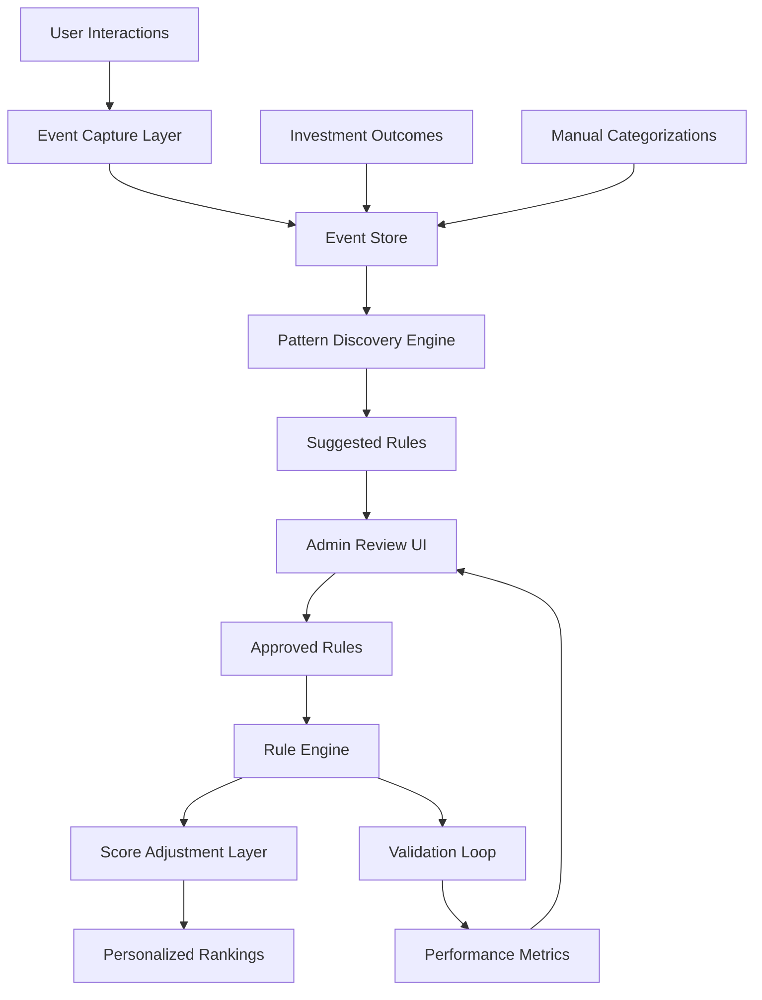

# Module 12: Context Engine (Adaptive Intelligence)

## Overview
The Context Engine is an adaptive intelligence system that learns from user behavior and investment outcomes to provide personalized scoring, pattern discovery, and rule-based automation. Unlike black-box ML systems, it uses **explicit, admin-approved rules** that are proposed based on observed patterns but only activated after human review.

## Core Principles

1. **Human-in-the-Loop**: All rules require explicit approval before activation
2. **Transparency**: Every scoring adjustment is traceable to a specific rule
3. **Stability**: Single outliers don't shift the entire system
4. **Role-Based**: Different partners can have different rules and strategies
5. **Evidence-Driven**: Rules are proposed based on statistically significant patterns

---

## Architecture Overview



---

## Database Schema

### 1. Event Tracking Tables

#### `context_events`
Core event log for all user interactions (append-only).

| Column | Type | Description |
|--------|------|-------------|
| `id` | UUID | Primary key |
| `user_id` | UUID | FK to users table |
| `event_type` | ENUM | `view`, `search`, `categorize`, `invest`, `exit`, `dismiss` |
| `event_timestamp` | TIMESTAMP | When event occurred |
| `entity_type` | VARCHAR | `company`, `sector`, `person`, `deal` |
| `entity_id` | UUID | ID of the entity |
| `context` | JSONB | Additional event-specific data |
| `session_id` | UUID | Groups events in same session |

**Indexes**: `user_id`, `event_type`, `event_timestamp`, `entity_type + entity_id`

#### `view_events`
Detailed view tracking.

| Column | Type | Description |
|--------|------|-------------|
| `id` | UUID | Primary key |
| `event_id` | UUID | FK to context_events |
| `user_id` | UUID | FK to users |
| `company_id` | UUID | FK to universe_companies |
| `duration_seconds` | INTEGER | Time spent viewing |
| `page_context` | VARCHAR | Where viewed (dashboard, search, deal flow) |
| `scroll_depth_pct` | INTEGER | How much of page viewed |
| `clicked_sections` | TEXT[] | Which tabs/sections opened |

**Indexes**: `user_id + company_id`, `duration_seconds DESC`

#### `search_events`
Search behavior tracking.

| Column | Type | Description |
|--------|------|-------------|
| `id` | UUID | Primary key |
| `event_id` | UUID | FK to context_events |
| `user_id` | UUID | FK to users |
| `query_text` | TEXT | Free-text search query (if any) |
| `filters_applied` | JSONB | Sector, revenue, geography filters |
| `sort_by` | VARCHAR | Sort criteria used |
| `results_count` | INTEGER | Number of results |
| `clicked_company_ids` | UUID[] | Which results were clicked |
| `clicked_rank` | INTEGER[] | Position of clicked results |

**Indexes**: `user_id`, `filters_applied GIN`

#### `categorization_events`
Manual categorizations and priority settings.

| Column | Type | Description |
|--------|------|-------------|
| `id` | UUID | Primary key |
| `event_id` | UUID | FK to context_events |
| `user_id` | UUID | FK to users |
| `company_id` | UUID | FK to universe_companies |
| `category` | VARCHAR | Custom user category/tag |
| `priority_level` | INTEGER | 1-5 priority rating |
| `notes` | TEXT | User notes |
| `deal_stage` | VARCHAR | Pipeline stage |

**Indexes**: `user_id + company_id`, `category`, `priority_level`

#### `investment_outcomes`
Track actual investment results.

| Column | Type | Description |
|--------|------|-------------|
| `id` | UUID | Primary key |
| `user_id` | UUID | FK to users (deal lead) |
| `company_id` | UUID | FK to universe_companies |
| `decision_type` | ENUM | `invested`, `passed`, `watching` |
| `decision_date` | DATE | When decision made |
| `investment_date` | DATE | Actual investment date (if invested) |
| `entry_valuation` | DECIMAL | Valuation at entry |
| `exit_date` | DATE | Exit date (if exited) |
| `exit_valuation` | DECIMAL | Valuation at exit |
| `multiple` | DECIMAL | Exit multiple (calculated) |
| `success_score` | INTEGER | 1-10 subjective success rating |
| `reason_codes` | TEXT[] | Why passed/invested |

**Indexes**: `user_id`, `decision_type`, `success_score DESC`

---

### 2. Rule Engine Tables

#### `investment_rules`
Core rules table (both active and proposed).

| Column | Type | Description |
|--------|------|-------------|
| `id` | UUID | Primary key |
| `rule_name` | VARCHAR(100) | Human-readable name |
| `description` | TEXT | What this rule does |
| `rule_type` | ENUM | `filter`, `score_boost`, `score_penalty`, `alert` |
| `scope` | ENUM | `user`, `team`, `firm` |
| `owner_user_id` | UUID | FK to users (who created/owns it) |
| `status` | ENUM | `proposed`, `testing`, `active`, `archived` |
| `condition_logic` | JSONB | Structured rule conditions (see below) |
| `action_config` | JSONB | What to do when rule matches |
| `priority` | INTEGER | Rule execution order (lower = higher priority) |
| `created_at` | TIMESTAMP | When rule was created |
| `approved_at` | TIMESTAMP | When admin approved |
| `approved_by` | UUID | FK to users (who approved) |
| `expires_at` | TIMESTAMP | Optional expiration |
| `last_validated` | TIMESTAMP | Last validation check |

**Indexes**: `status`, `scope`, `owner_user_id`, `priority`

**Example `condition_logic` JSONB**:
```json
{
  "operator": "AND",
  "conditions": [
    {
      "field": "sector",
      "operator": "IN",
      "values": ["FinTech", "DevTools", "HealthTech"]
    },
    {
      "field": "arr",
      "operator": "BETWEEN",
      "min": 5000000,
      "max": 50000000
    },
    {
      "field": "moat_score",
      "operator": ">=",
      "value": 70
    }
  ]
}
```

**Example `action_config` JSONB**:
```json
{
  "type": "score_boost",
  "adjustment": 15,
  "explanation": "Matches focus sectors and revenue sweet spot"
}
```

#### `rule_permissions`
Role-based access control for rules.

| Column | Type | Description |
|--------|------|-------------|
| `id` | UUID | Primary key |
| `rule_id` | UUID | FK to investment_rules |
| `role` | ENUM | `analyst`, `associate`, `partner`, `admin` |
| `can_view` | BOOLEAN | Can see rule |
| `can_apply` | BOOLEAN | Can apply to their view |
| `can_edit` | BOOLEAN | Can modify rule |
| `can_approve` | BOOLEAN | Can approve proposed rules |

**Indexes**: `rule_id + role`

#### `rule_evidence`
Supporting data for why a rule was proposed.

| Column | Type | Description |
|--------|------|-------------|
| `id` | UUID | Primary key |
| `rule_id` | UUID | FK to investment_rules |
| `evidence_type` | ENUM | `pattern`, `outcome`, `manual` |
| `metric_name` | VARCHAR | What was measured |
| `metric_value` | DECIMAL | Measured value |
| `sample_size` | INTEGER | N for this evidence |
| `confidence_score` | DECIMAL | Statistical confidence (0-1) |
| `description` | TEXT | Human explanation |
| `supporting_data` | JSONB | Detailed breakdown |
| `created_at` | TIMESTAMP | When evidence collected |

**Indexes**: `rule_id`, `confidence_score DESC`

**Example evidence**:
```json
{
  "rule_id": "abc-123",
  "evidence_type": "outcome",
  "metric_name": "win_rate_with_condition",
  "metric_value": 0.68,
  "sample_size": 22,
  "confidence_score": 0.85,
  "description": "Companies with >40% gross margins had 68% win rate vs 32% baseline",
  "supporting_data": {
    "matching_investments": 15,
    "matching_passes": 7,
    "baseline_investments": 45,
    "baseline_passes": 95
  }
}
```

#### `rule_applications`
Track when rules are applied.

| Column | Type | Description |
|--------|------|-------------|
| `id` | UUID | Primary key |
| `rule_id` | UUID | FK to investment_rules |
| `applied_to_user_id` | UUID | FK to users |
| `company_id` | UUID | FK to universe_companies |
| `applied_at` | TIMESTAMP | When rule was applied |
| `score_before` | INTEGER | Score before rule |
| `score_after` | INTEGER | Score after rule |
| `adjustment` | INTEGER | Delta |

**Indexes**: `rule_id`, `applied_to_user_id + company_id`, `applied_at DESC`

#### `rule_performance`
Aggregate performance metrics per rule.

| Column | Type | Description |
|--------|------|-------------|
| `id` | UUID | Primary key |
| `rule_id` | UUID | FK to investment_rules |
| `evaluation_period_start` | DATE | Start of measurement window |
| `evaluation_period_end` | DATE | End of measurement window |
| `times_applied` | INTEGER | How many times rule fired |
| `companies_boosted` | INTEGER | Companies affected |
| `top_10_overlap` | DECIMAL | % of rule matches in top 10 results |
| `investment_conversion` | DECIMAL | % of boosted companies that were invested in |
| `avg_success_score` | DECIMAL | Avg outcome for investments from this rule |
| `false_positive_rate` | DECIMAL | % boosted but passed |
| `recommendation` | ENUM | `keep`, `modify`, `archive` |

**Indexes**: `rule_id + evaluation_period_end DESC`

---

### 3. Pattern Discovery Tables

#### `discovered_patterns`
Patterns detected by analysis engine.

| Column | Type | Description |
|--------|------|-------------|
| `id` | UUID | Primary key |
| `user_id` | UUID | FK to users (pattern is specific to) |
| `pattern_type` | ENUM | `sector_affinity`, `signal_preference`, `outcome_correlation`, `temporal` |
| `pattern_name` | VARCHAR | Auto-generated descriptive name |
| `description` | TEXT | Human-readable explanation |
| `discovered_at` | TIMESTAMP | When pattern was found |
| `confidence_score` | DECIMAL | Statistical confidence (0-1) |
| `sample_size` | INTEGER | Events analyzed |
| `pattern_data` | JSONB | Structured pattern details |
| `suggested_rule_id` | UUID | FK to investment_rules (if converted) |
| `status` | ENUM | `new`, `reviewed`, `converted`, `dismissed` |

**Indexes**: `user_id`, `pattern_type`, `confidence_score DESC`, `status`

**Example `pattern_data` JSONB**:
```json
{
  "pattern_type": "sector_affinity",
  "details": {
    "sector": "DevTools",
    "view_count": 47,
    "avg_duration_seconds": 285,
    "compared_to_baseline": "+220%",
    "investments_in_sector": 4,
    "sector_win_rate": 0.67
  }
}
```

#### `affinity_scores`
Pre-computed affinity scores for quick lookups.

| Column | Type | Description |
|--------|------|-------------|
| `id` | UUID | Primary key |
| `user_id` | UUID | FK to users |
| `affinity_type` | ENUM | `user_sector`, `user_company`, `user_signal`, `user_geography` |
| `entity_id` | VARCHAR | ID of sector/signal/etc |
| `entity_name` | VARCHAR | Human-readable name |
| `affinity_score` | DECIMAL | 0-100 affinity strength |
| `interaction_count` | INTEGER | Number of interactions |
| `recency_weight` | DECIMAL | Recent vs historical |
| `last_updated` | TIMESTAMP | When score was calculated |

**Indexes**: `user_id + affinity_type`, `affinity_score DESC`

---

## Core Components

### 1. Event Capture Layer

**Location**: `src/context/event_capture.py`

**Purpose**: Middleware to capture all user interactions across the platform.

**Key Classes**:

```python
class EventCapture:
    """Captures and logs user interactions."""
    
    @staticmethod
    async def log_event(
        user_id: UUID,
        event_type: EventType,
        entity_type: str,
        entity_id: UUID,
        context: dict = None
    ) -> UUID:
        """Log a single event to context_events table."""
        
    @staticmethod
    async def log_view(
        user_id: UUID,
        company_id: UUID,
        duration_seconds: int,
        page_context: str,
        interaction_data: dict
    ):
        """Log detailed view event."""
        
    @staticmethod
    async def log_search(
        user_id: UUID,
        filters: dict,
        results: list[UUID],
        clicks: list[tuple[UUID, int]]  # (company_id, rank)
    ):
        """Log search behavior."""
        
    @staticmethod
    async def log_categorization(
        user_id: UUID,
        company_id: UUID,
        category: str,
        priority: int,
        deal_stage: str = None
    ):
        """Log manual categorization."""
        
    @staticmethod
    async def log_investment_outcome(
        user_id: UUID,
        company_id: UUID,
        decision_type: DecisionType,
        details: dict
    ):
        """Log investment decision and outcomes."""
```

**Integration Points**:
- FastAPI middleware to auto-capture API calls
- React hooks to track UI interactions
- Background job for batch event processing

---

### 2. Pattern Discovery Engine

**Location**: `src/context/pattern_discovery.py`

**Purpose**: Analyze event data to identify statistically significant patterns.

**Key Classes**:

```python
class PatternDiscovery:
    """Discovers patterns from user behavior."""
    
    def __init__(self, min_confidence: float = 0.75, min_sample_size: int = 10):
        self.min_confidence = min_confidence
        self.min_sample_size = min_sample_size
        
    async def discover_sector_affinities(self, user_id: UUID) -> list[Pattern]:
        """
        Identify which sectors user focuses on.
        
        Algorithm:
        1. Group events by sector
        2. Calculate: view_count, avg_duration, investment_rate
        3. Compare to user's baseline across all sectors
        4. Flag sectors with >2σ deviation
        """
        
    async def discover_signal_preferences(self, user_id: UUID) -> list[Pattern]:
        """
        Identify which data fields user prioritizes.
        
        Algorithm:
        1. Track which fields are viewed/clicked in UI
        2. Correlate field views with investment decisions
        3. Identify fields with high predictive value for user
        """
        
    async def discover_outcome_correlations(self, user_id: UUID) -> list[Pattern]:
        """
        Find company attributes that correlate with successful investments.
        
        Algorithm:
        1. Join investment_outcomes with company attributes
        2. Run correlation analysis for each attribute
        3. Identify attributes with p-value < 0.05
        4. Calculate effect size (Cohen's d)
        """
        
    async def discover_temporal_patterns(self, user_id: UUID) -> list[Pattern]:
        """
        Detect changes in behavior over time.
        
        Use cases:
        - New sector focus emerging
        - Criteria becoming more/less strict
        - Shift in deal size preferences
        """
        
    async def suggest_rules_from_patterns(
        self,
        pattern_id: UUID
    ) -> InvestmentRule:
        """
        Convert a validated pattern into a proposed rule.
        
        Returns rule in 'proposed' status with supporting evidence.
        """
```

**Statistical Methods**:
- **Chi-squared test** for categorical correlations
- **T-test** for continuous variable differences
- **Effect size (Cohen's d)** to ensure practical significance
- **Bonferroni correction** for multiple testing

---

### 3. Rule Engine

**Location**: `src/context/rule_engine.py`

**Purpose**: Apply approved rules to scoring and filtering.

**Key Classes**:

```python
class RuleEngine:
    """Evaluates and applies investment rules."""
    
    def __init__(self):
        self._rules_cache: dict[UUID, InvestmentRule] = {}
        
    async def load_active_rules(
        self,
        user_id: UUID,
        scope: RuleScope = None
    ) -> list[InvestmentRule]:
        """
        Load all active rules for a user.
        
        Includes:
        - User's personal rules (scope=user)
        - Team rules that apply to user's role
        - Firm-wide rules
        
        Sorted by priority (ascending).
        """
        
    async def evaluate_rule(
        self,
        rule: InvestmentRule,
        company: UniverseCompany
    ) -> RuleMatch:
        """
        Check if a company matches a rule's conditions.
        
        Returns:
        - matched: bool
        - explanation: str (why it matched/didn't match)
        - adjustment: int (score change if applies)
        """
        
    async def apply_rules(
        self,
        user_id: UUID,
        companies: list[UniverseCompany]
    ) -> list[ScoredCompany]:
        """
        Apply all active rules to a list of companies.
        
        Algorithm:
        1. Load active rules for user
        2. For each company:
           a. Evaluate all rules in priority order
           b. Track which rules matched
           c. Calculate cumulative score adjustment
           d. Cap total adjustment at ±30 points
        3. Log rule applications
        4. Return companies with adjusted scores + explanations
        """
        
    def _evaluate_condition(
        self,
        condition: dict,
        company: UniverseCompany
    ) -> bool:
        """
        Evaluate a single condition from condition_logic JSONB.
        
        Supports operators:
        - IN, NOT IN (lists)
        - >, <, >=, <=, == (numeric)
        - BETWEEN (numeric range)
        - CONTAINS, NOT CONTAINS (arrays)
        - AND, OR, NOT (logical combinators)
        """
        
    async def validate_rule_performance(
        self,
        rule_id: UUID,
        lookback_days: int = 90
    ) -> RulePerformance:
        """
        Calculate performance metrics for a rule.
        
        Metrics:
        - Hit rate (% of companies it applies to)
        - Investment conversion (% of matches that were invested)
        - Success rate (% of investments that succeeded)
        - False positive rate (% of matches that were passed)
        
        Used for monthly validation loop.
        """
```

**Rule Condition Schema**:
```python
# Atomic condition
{
    "field": "arr",
    "operator": ">=",
    "value": 5000000
}

# Compound condition
{
    "operator": "AND",
    "conditions": [
        {"field": "sector", "operator": "IN", "values": ["FinTech", "DevTools"]},
        {"field": "moat_score", "operator": ">=", "value": 70},
        {
            "operator": "OR",
            "conditions": [
                {"field": "hq_country", "operator": "==", "value": "UK"},
                {"field": "hq_country", "operator": "==", "value": "DE"}
            ]
        }
    ]
}
```

---

### 4. Score Adjustment Layer

**Location**: `src/context/scoring.py`

**Purpose**: Integrate rule-based adjustments with base scoring systems.

**Key Functions**:

```python
async def get_personalized_scores(
    user_id: UUID,
    companies: list[UniverseCompany],
    base_scorer: AttractivenessScorer
) -> list[PersonalizedScore]:
    """
    Combine base scores with rule-based adjustments.
    
    Returns:
    - company_id
    - base_score (from AttractivenessScorer)
    - rule_adjustments: list[RuleAdjustment]
    - final_score (capped at 0-100)
    - explanation: str (breakdown of scoring)
    """
    
class PersonalizedScore:
    company_id: UUID
    base_score: int
    rule_adjustments: list[RuleAdjustment]
    final_score: int
    explanation: str
    
class RuleAdjustment:
    rule_id: UUID
    rule_name: str
    adjustment: int  # +/- points
    reason: str
```

---

### 5. Admin UI Components

**Key Interfaces**:

#### A. Rule Management Dashboard

**Location**: `frontend/src/components/context/RulesDashboard.jsx`

**Features**:
- List all rules (grouped by status: active, testing, proposed, archived)
- Filter by scope (user/team/firm)
- Search rules by name/description
- Quick stats: # active rules, avg score impact, top performing rules

#### B. Rule Editor

**Location**: `frontend/src/components/context/RuleEditor.jsx`

**Features**:
- Visual rule builder (no coding required)
- Field selector (sector, arr, moat_score, geography, etc.)
- Operator selector (>, <, IN, BETWEEN, etc.)
- Value input (with autocomplete for categories)
- Compound logic builder (AND/OR/NOT)
- Preview: "This rule would match N companies in your current Universe"
- Set action type (boost/penalty/filter/alert)
- Save as proposed or testing

#### C. Pattern Discovery Feed

**Location**: `frontend/src/components/context/PatternFeed.jsx`

**Features**:
- List of discovered patterns (sorted by confidence)
- For each pattern:
  - Name & description
  - Confidence score + sample size
  - Supporting evidence (charts/graphs)
  - Actions: [Convert to Rule] [Dismiss] [Tell Me More]
- Quick-convert button → opens Rule Editor pre-filled

#### D. Rule Performance Report

**Location**: `frontend/src/components/context/RulePerformance.jsx`

**Features**:
- Table view of all active rules
- Columns: Name, Applications (30d), Conversion Rate, Success Score, Recommendation
- Drill-down: Click rule → see companies it matched, outcomes
- Validation warnings: "Rule #4 has 0% conversion - consider archiving"
- Bulk actions: Archive multiple underperforming rules

#### E. Company Score Breakdown

**Location**: Add to existing `UniverseCompanyDetail.jsx`

**Features**:
- Show base score + each rule adjustment
- Visual breakdown:
  ```
  Base Score:        67
  + Rule: Focus Sectors     +15
  + Rule: Revenue Sweet Spot +10
  - Rule: Geographic Exclusion -5
  ─────────────────────
  Final Score:       87
  ```
- Click rule name → see rule details

---

## API Endpoints

### Rules API

**Base path**: `/api/v1/context/rules`

| Method | Endpoint | Description |
|--------|----------|-------------|
| `GET` | `/` | List all rules for current user (with filters) |
| `GET` | `/{rule_id}` | Get rule details |
| `POST` | `/` | Create new rule (status=proposed) |
| `PUT` | `/{rule_id}` | Update rule (only if proposed/testing) |
| `DELETE` | `/{rule_id}` | Archive rule |
| `POST` | `/{rule_id}/approve` | Approve proposed rule → active |
| `POST` | `/{rule_id}/test` | Move rule to testing mode |
| `GET` | `/{rule_id}/preview` | Preview rule impact on current Universe |
| `GET` | `/{rule_id}/performance` | Get performance metrics |

### Patterns API

**Base path**: `/api/v1/context/patterns`

| Method | Endpoint | Description |
|--------|----------|-------------|
| `GET` | `/` | List discovered patterns for user |
| `GET` | `/{pattern_id}` | Get pattern details + evidence |
| `POST` | `/{pattern_id}/convert` | Convert pattern to proposed rule |
| `POST` | `/{pattern_id}/dismiss` | Mark pattern as not interesting |
| `POST` | `/discover` | Trigger pattern discovery job (async) |

### Events API

**Base path**: `/api/v1/context/events`

| Method | Endpoint | Description |
|--------|----------|-------------|
| `POST` | `/view` | Log view event |
| `POST` | `/search` | Log search event |
| `POST` | `/categorize` | Log categorization |
| `POST` | `/outcome` | Log investment outcome |
| `GET` | `/my-activity` | Get user's recent activity |

### Scoring API

**Base path**: `/api/v1/context/scoring`

| Method | Endpoint | Description |
|--------|----------|-------------|
| `POST` | `/personalized` | Get personalized scores for company list |
| `GET` | `/company/{company_id}/breakdown` | Get score breakdown for one company |
| `GET` | `/my-affinities` | Get user's affinity scores (sectors, signals, etc.) |

---

## Integration with Existing Modules

### Universe Scanner
**File**: `src/universe/workflow.py`

**Integration**:
```python
# Add personalized scoring to enrichment workflow
from src.context.scoring import get_personalized_scores

async def score_for_user(user_id: UUID, companies: list[UniverseCompany]):
    # Get base scores (existing)
    base_scores = [scorer.score_company(c) for c in companies]
    
    # Apply personalized rules
    personalized = await get_personalized_scores(
        user_id=user_id,
        companies=companies,
        base_scorer=scorer
    )
    
    # Update database with both scores
    for company, score in zip(companies, personalized):
        company.base_score = score.base_score
        company.personalized_score = score.final_score
        company.score_explanation = score.explanation
```

**New Fields in `universe_companies`**:
- `base_score` (existing moat score)
- `personalized_score_cache` (JSONB: user_id → score mapping)

### Dashboard
**File**: `frontend/src/components/Dashboard.jsx`

**Integration**:
- Add toggle: "Show personalized rankings"
- Default to personalized if user has active rules
- Show indicator when rules are active (e.g., "🎯 3 rules applied")

### Search & Filters
**File**: `frontend/src/components/universe/UniverseSearch.jsx`

**Integration**:
- Results sorted by personalized_score (if available), else base_score
- Add "Recommended for You" section (top 5 rule-boosted companies)
- Show rule match indicators on company cards

### Capital Flows
**File**: `src/capital/workflow.py`

**Integration**:
- Log when user views PE firm portfolio company
- Pattern: "You often research companies backed by [Firm X]"
- Suggested rule: "Boost companies backed by [Firm X]"

### Competitive Radar
**File**: `src/competitive/workflow.py`

**Integration**:
- Log when user dismisses competitive threat
- Pattern: "You always dismiss competitors in X sub-sector"
- Suggested filter rule: "Exclude X sub-sector from competitive alerts"

---

## Phased Implementation Roadmap

### Phase 1: Event Infrastructure (Week 1-2)
**Goal**: Start capturing data without changing user experience.

**Tasks**:
1. Create database schema (all tables)
2. Build `EventCapture` class
3. Add FastAPI middleware to log API calls
4. Add React hooks to log UI interactions
5. Create background job for event processing
6. Build admin dashboard to view raw events (debugging)

**Success Criteria**:
- All user interactions logged to `context_events`
- No performance impact (<50ms overhead)
- 30 days of event data collected

### Phase 2: Rule Engine Core (Week 3-4)
**Goal**: Manual rule creation and application.

**Tasks**:
1. Build `RuleEngine` class
2. Create `RuleEditor` UI component
3. Implement rule evaluation logic
4. Build `get_personalized_scores()` function
5. Add `/api/v1/context/rules` endpoints
6. Create `RulesDashboard` UI
7. Integrate with Universe scoring
8. Add score breakdown to company detail pages

**Success Criteria**:
- User can create, edit, activate rules via UI
- Rules correctly adjust company scores
- Score breakdown shows which rules applied
- Rule applications logged for validation

### Phase 3: Pattern Discovery (Week 5-6)
**Goal**: AI-suggested rules based on behavior.

**Tasks**:
1. Build `PatternDiscovery` class
2. Implement statistical analysis algorithms
3. Create background job to run discovery weekly
4. Build `PatternFeed` UI component
5. Add "Convert to Rule" workflow
6. Create `/api/v1/context/patterns` endpoints
7. Email notifications for high-confidence patterns

**Success Criteria**:
- System identifies 3-5 patterns per user per month
- Patterns have >75% confidence
- Users can one-click convert patterns to rules
- At least 30% of suggested patterns are converted

### Phase 4: Validation & Optimization (Week 7-8)
**Goal**: Close the feedback loop with outcomes.

**Tasks**:
1. Build investment outcome tracking UI
2. Create `validate_rule_performance()` function
3. Build `RulePerformance` dashboard
4. Monthly rule validation job
5. Auto-flag underperforming rules
6. A/B testing framework (shadow mode)
7. Export rule reports (PDF/CSV)

**Success Criteria**:
- Investment outcomes tracked for 80%+ of decisions
- Monthly performance reports generated
- Rules with <20% conversion auto-flagged
- Users archive 50%+ of flagged rules

### Phase 5: Role-Based & Advanced Features (Week 9-10)
**Goal**: Multi-user firms, collaboration, advanced logic.

**Tasks**:
1. Implement `rule_permissions` table
2. Add role-based rule visibility
3. Team rule proposals (require partner approval)
4. Firm-wide rule library
5. Rule templates (pre-built common rules)
6. Advanced condition operators (REGEX, date ranges, custom SQL)
7. Rule versioning & change history
8. Slack/email notifications for rule approvals

**Success Criteria**:
- Different roles see different rules
- Partner approval workflow functional
- Firm can maintain 5-10 core rules across all users

---

## Advanced Features (Future)

### 1. Collaborative Filtering
- "Users similar to you also prioritize [X]"
- Cross-user pattern discovery (anonymized, opt-in)

### 2. Natural Language Rule Builder
- "Show me European SaaS companies with >€10M ARR"
- Convert to structured rule automatically

### 3. Temporal Rules
- "Only apply this rule during H1" (seasonal strategies)
- "Suspend this rule during recessions" (macro-aware)

### 4. Multi-Objective Optimization
- User sets multiple goals: "Maximize moat, minimize competition"
- System balances rules to optimize for all goals

### 5. Explainable AI
- "This company ranked #3 instead of #15 because..."
- Visual decision tree showing rule cascade

### 6. Simulation Mode
- "If I had used these rules last year, how would my portfolio look?"
- Backtest rules against historical outcomes

---

## Security & Privacy Considerations

### Data Privacy
- User events are PII - encrypt at rest
- No cross-firm data leakage
- GDPR compliance: users can export/delete event history
- Anonymization for aggregate analytics

### Access Control
- Rules scoped by user/team/firm
- Role-based permissions (RBAC)
- Audit log for rule approvals/changes
- Admins can't see other users' rules without permission

### Data Retention
- Raw events: 2 years, then archived
- Aggregated patterns: indefinite
- Deleted users: events anonymized (user_id → NULL)

---

## Performance Considerations

### Caching Strategy
- Active rules cached in Redis (1 hour TTL)
- Affinity scores materialized daily
- Personalized scores cached per user-company pair (invalidate on rule change)

### Scale Estimates
- 10 users × 1000 companies × 10 rules = 100K rule evaluations per page load
- Target: <200ms for full personalization
- Solution: Parallel rule evaluation, index-optimized queries

### Async Processing
- Event capture: fire-and-forget (don't block user actions)
- Pattern discovery: weekly background job
- Rule validation: monthly background job
- Score caching: nightly batch job

---

## Testing Strategy

### Unit Tests
- Rule evaluation logic (all operators)
- Pattern discovery algorithms (with mock data)
- Score adjustment calculations

### Integration Tests
- Full rule lifecycle (create → approve → apply → validate)
- Multi-rule interactions (conflicting rules)
- Cross-module integration (Universe + Context)

### E2E Tests
- User creates rule via UI
- Rule applies to search results
- Personalized score visible on company page

### Performance Tests
- 10K companies × 10 rules: <500ms
- Event capture: <10ms overhead
- Concurrent users: 100 users × 100 req/s

---

## Success Metrics

### Adoption Metrics
- % users with ≥1 active rule (target: 80% after 3 months)
- Avg rules per user (target: 3-5)
- Pattern → rule conversion rate (target: 30%)

### Engagement Metrics
- Time saved per search (reduced browsing)
- Relevance score (% of top 10 clicked)
- Return visit rate (daily active users)

### Outcome Metrics
- Investment win rate (with rules vs without)
- Portfolio returns (rule-influenced deals)
- User-reported satisfaction (NPS survey)

---

## Open Questions & Design Decisions

1. **Rule conflict resolution**: If two rules disagree (one boosts, one penalizes), which wins?
   - **Recommendation**: Priority order + cap total adjustment

2. **Cold start problem**: New users have no events - what do they see?
   - **Recommendation**: Firm-wide default rules + onboarding questionnaire

3. **Rule complexity limit**: How nested can condition logic be?
   - **Recommendation**: Max 3 levels of nesting to prevent over-engineering

4. **Pattern discovery frequency**: How often to run analysis?
   - **Recommendation**: Weekly for active users, monthly for inactive

5. **Outcome data source**: Manual entry vs automated (if using deal tracking software)?
   - **Recommendation**: Start manual, integrate with CRM later

---

## Conclusion

The Context Engine transforms RADAR from a static research tool into an **adaptive partner** that learns and improves with use. By focusing on **explicit, approved rules** rather than black-box ML, we maintain transparency and trust while still providing powerful personalization.

**Key Differentiators**:
✅ Human-in-the-loop (not autopilot)  
✅ Evidence-driven (statistical rigor)  
✅ Auditable (know why every score changed)  
✅ Role-aware (partner vs analyst views)  
✅ Outcome-validated (close the loop)  

**Next Steps**:
1. Review and approve this spec
2. Create detailed task.md for Phase 1
3. Set up development environment
4. Begin event infrastructure implementation
