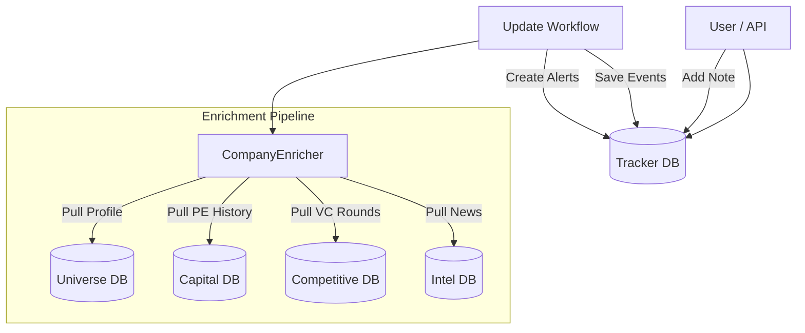

# Module 3: Target Tracker

## Overview

The Target Tracker module monitors high-priority investment targets, aggregating data from all other RADAR modules to provide a unified view of company activity and detecting significant events that warrant attention.

### Key Features

1.  **Unified Company Profile**: Aggregates data from Universe (financials), Capital (PE history), Competitive (VC activity), and Intel (news) modules.
2.  **Event Detection**: Automatically checks for new funding rounds, PE investments, and news mentions.
3.  **Alerting System**: Generates "Critical" or "High" severity alerts for significant events.
4.  **Workflow Automation**: Scheduled updates to keep tracked company data fresh.
5.  **User Annotations**: Allows adding research notes and tags to tracked companies.

---

## Architecture



---

## Data Models

### TrackedCompany
The central record linking to a `Company` in the Universe module.
- `tracking_status`: Active, Paused, Closed
- `priority`: High (daily check), Medium (3-day), Low (weekly)
- `next_check_due`: Timestamp for next scheduled enrichment

### CompanyEvent
Timeline of significant happenings.
- `event_type`: Funding, Leadership Change, News, etc.
- `severity`: Critical, High, Medium, Low
- `source_url`: Link to source (news article, announcement)

### TrackingAlert
Actionable notifications for the user.
- Created when High/Critical events are detected.
- Status: Read/Unread

---

## Usage Guide

### CLI Commands

The module includes a CLI for managing tracked companies and running manual updates.

**Add a company to tracking:**
```bash
python -m src.tracker.workflow add <COMPANY_ID> --priority high --tags "aerospace" "buyout"
```

**Run update workflow (enrichment):**
```bash
python -m src.tracker.workflow update
# Use --force to check all companies regardless of schedule
python -m src.tracker.workflow update --force
```

**View unread alerts:**
```bash
python -m src.tracker.workflow alerts
```

### API Endpoints

| Method | Endpoint | Description |
|--------|----------|-------------|
| `POST` | `/api/tracker/add` | Add a company to tracking |
| `GET` | `/api/tracker/companies` | List all tracked companies |
| `GET` | `/api/tracker/company/{id}` | Get detailed enriched profile |
| `POST` | `/api/tracker/company/{id}/note` | Add a research note |
| `GET` | `/api/tracker/alerts` | Get unread alerts |

---

## Integration Details

### Enrichment Logic (`src/tracker/enricher.py`)

The `CompanyEnricher` class is responsible for "joining" data across modules.

1.  **`enrich_tracked_company(id)`**: 
    - Fetches base record from `Universe`.
    - Queries `VCAnnouncementModel` for recent rounds.
    - Queries `PEInvestmentModel` for previous ownership.
    - Queries `ThreatScoreModel` for competitive analysis.
    - Returns a JSON-serializable dictionary.

2.  **`detect_events(id, since_date)`**:
    - Scans for new records in other modules created after `since_date`.
    - **VC Funding**: Detected via new `VCAnnouncement` records matching company name.
    - **PE Investment**: Detected via new `PEInvestment` records.
    - **News**: Detected via `IntelligenceItem` records with high relevance score.

### Workflow Logic (`src/tracker/workflow.py`)

The `update_tracked_companies` function orchestrates the update process:
1.  Selects companies due for checking (`next_check_due <= now`).
2.  Calls `enricher.detect_events()` for each.
3.  Persists new events to `CompanyEvent`.
4.  If severity is High/Critical, creates `TrackingAlert`.
5.  Updates `last_checked` and schedules next check based on priority.
